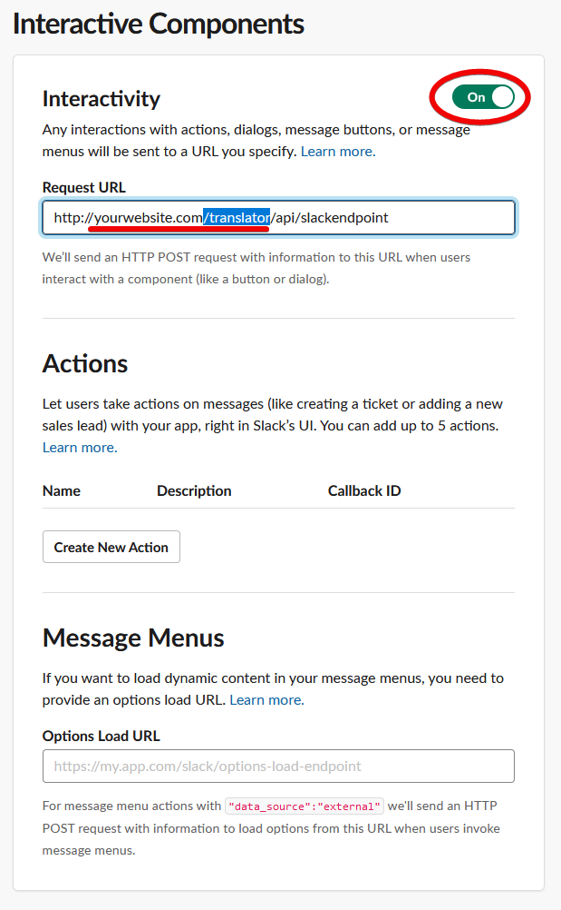

# TRANSLATOR PLUGIN

The **TRANSLATOR** Plugin is an extension for [Grav CMS](http://github.com/getgrav/grav).

## Installation

Installing the Mde plugin can be done in one of three ways: The GPM (Grav Package Manager) installation method lets you quickly install the plugin with a simple terminal command, the manual method lets you do so via a zip file, and the admin method lets you do so via the Admin Plugin.

### GPM Installation (Preferred)

To install the plugin via the [GPM](http://learn.getgrav.org/advanced/grav-gpm), through your system's terminal (also called the command line), navigate to the root of your Grav-installation, and enter:

    bin/gpm install translator

This will install the Mde plugin into your `/user/plugins` directory within Grav. Its files can be found under `/your/site/grav/user/plugins/translator`.

### Manual Installation

To install the plugin manually, download the zip-version of this repository and unzip it under `/your/site/grav/user/plugins`. Then rename the folder to `mde`. You can find these files on [GitHub](https://github.com/ricardo118/grav-plugin-mde) or via [GetGrav.org](http://getgrav.org/downloads/plugins#extras).

You should now have all the plugin files under

    /your/site/grav/user/plugins/translator

> NOTE: This plugin requires the Email Plugin for Grav if you are not using the Slack notifications.

### Admin Plugin

If you use the Admin Plugin, you can install the plugin directly by browsing the `Plugins`-menu and clicking on the `Add` button.

## Configuration

Before configuring this plugin, you should copy the `user/plugins/translator/translator.yaml` to `user/config/plugins/translator.yaml` and only edit that copy.

Here is the default configuration and an explanation of available options:

```yaml
enabled: true
base_route: '/translator'                   # The plugin will operate under this route for all functionality.
fields:                                     # Which fields the plugin allows for translation, every other field is ignored
  - text
  - textarea
  - editor
  - ckeditor
  - markdown
slack:
  enabled: false                            # Enable slack notifications
  webhook: ''                               # The webhook URL - generate your own via slack developer app
  channel: '#general'                       # The channel in which to send the message
style:
  color: '#39CCCC'                          # Teal
  logo:
    user/plugins/translator/images/grav-logo.png:
      name: grav-logo.png
      type: image/png
      size: 14215
      path: user/plugins/translator/images/grav-logo.png
```

Note that if you use the Admin Plugin, a file with your configuration named translator.yaml will be saved in the `user/config/plugins/`-folder once the configuration is saved in the Admin.

## SETUP

The plugin has a few simple requirements.

### 1. For best use of the plugin, blueprints are recommended.
The plugin uses blueprints to determine which fields should appear or not in the translation area. By default, all text, textarea, editor, fields will automatically be enabled. However, you can enable or disable specific types by adding a `translator: true` or `translator: false` key to a field. For example:

Lets say we have the following field:
```yaml
header.id:
    type: text
    label: My Personal ID
```

This is a field that we dont want to allow for translation, so we can make the plugin skip this field by adding `translator: false`.

```yaml
header.id:
    type: text
    label: My Personal ID
    translator: false
```

### 2. For a `translator` to be allowed access into the translator area they require 2 things added to their user account:
Example File: `user/accounts/username.yaml`
```yaml
access:
  site:
    translator: 'true'
```

Any admin with `super: true` access will also be able to enter the translators area. However, before you can edit any language, you must first tell the plugin which language each user is allowed to translate. This can be done by adding the following:

Example File: `user/accounts/username.yaml`
```yaml
translator:
  - de
  - en
  - es
  - sv
```
You can add as many languages as you want (as long as you have already enabled them in your multi-lang site).

You may also enable **ALL enabled languages** to be given access by simply adding: `- super`.

Example File: `user/accounts/admin.yaml`
```yaml
translator:
  - super
```

You are now ready to start translating!

## HOW TO ENABLE SLACK NOTIFICATIONS


Go to [SLACK API](https://api.slack.com/apps) and sign in your with Slack account. Make sure you are on the correct workspace too!

Hit the `Create New App` button - Fill in the details, you can pick any name you wish.


Now you will need to enable 2 features:
Enable `Incoming Webhooks` and `Interactive Components`


#### `Incoming Webhooks`

1. Click `Add New Webhook to Workspace` button at the bottom of the page. Select the channel you wish to send messages to.
Your end result should be something like this:


Now copy the webhook url and the channel to the plugin configurations as shown above:

File: `user/configs/plugins/translator.yaml`
```yaml
slack:
  enabled: true
  webhook: 'https://hooks.slack.com/services/...'
  channel: '#test'
```

#### `Interactive Components`

1. Click Interactive Components on the sidebar menu and turn `Interactivity` to `on`

2. Add the `Request URL` as follows:

`https://yourwebsite.com/translator/api/slackendpoint`

**NOTE: Replace `yourwebsite.com` with the domain you are using the plugin on, and replace the `/translator` **ONLY** if you have modified the default `base_route` variable**



Now you can enable Slack notifications in your plugin for approving and denying translator submitted pages.

Enjoy
